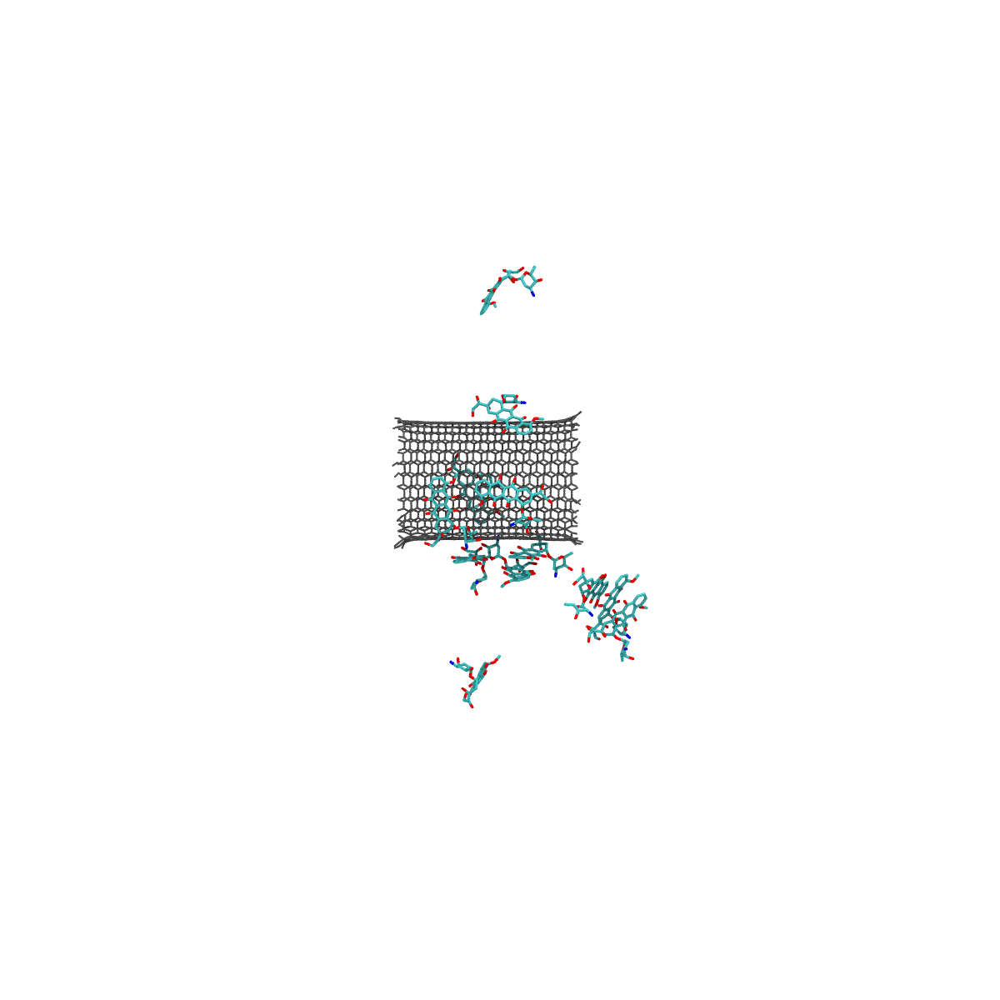
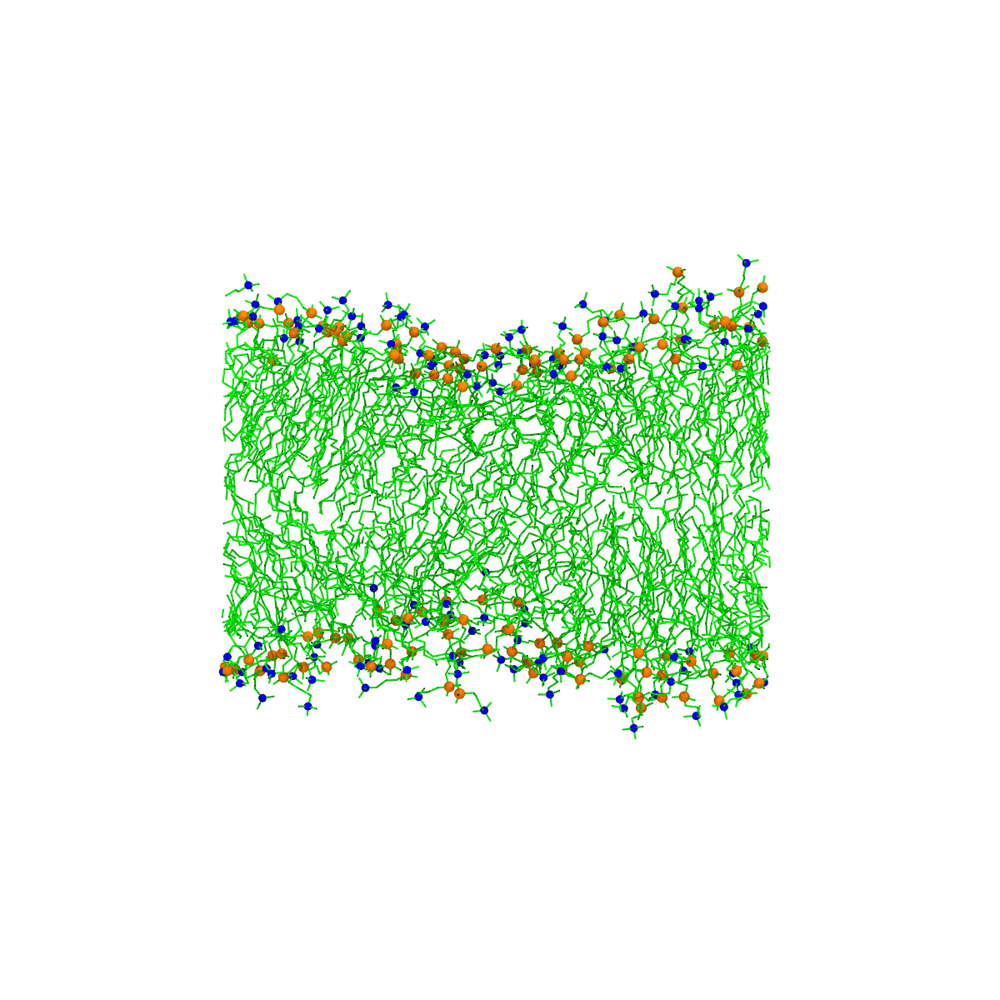
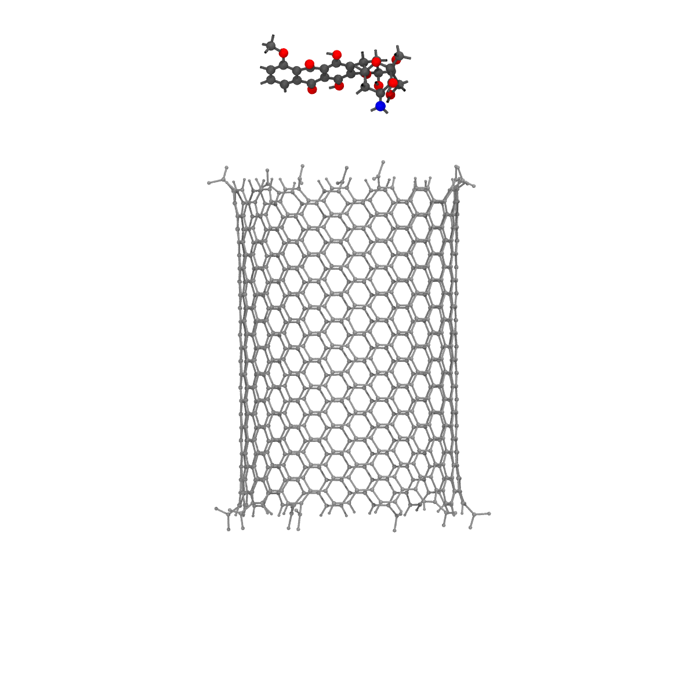

# Molecular Dynamics Simulation Course

This repository contains molecular dynamics simulations and practical exercises completed as part of the **Advanced Molecular Dynamics and Protein Simulation with GROMACS** course by **FaraDars**, which I completed in June 2025.

The projects were carried out primarily using **GROMACS** for molecular dynamics simulations and **VMD** for molecular visualization and trajectory rendering.

## Course

**Advanced Molecular Dynamics and Protein Simulation with GROMACS**  
Instructor: **Dr. Azadeh Kordzadeh**  
Completed: **June 20, 2025**

- [Course page](https://faradars.org/courses/simulation-of-molecular-dynamics-and-proteins-with-gromacs-supplementary-fvch0101)
- [Certificate verification](https://faradars.org/verify/C89CA8ED)

---

## Repository Contents

### S03 — Lysozyme Molecular Dynamics

Molecular dynamics simulation of **lysozyme in explicit solvent**.

The system was prepared, energy-minimized, equilibrated under NVT and NPT conditions, and followed by a production MD simulation.

---

### S04 — Carbon Nanotube and Doxorubicin

Molecular dynamics simulation of **doxorubicin (DOX)** interacting with a **carbon nanotube (CNT)** in aqueous solution.

The trajectory shows the motion and interaction of multiple DOX molecules around the nanotube surface.

---

### S05 — DPPC Membrane Simulation

Molecular dynamics simulation of a **DPPC lipid bilayer** in explicit solvent, including membrane preparation, equilibration, and production MD.

---

### S06 — Doxorubicin Pulling Through a Carbon Nanotube

Steered molecular dynamics and umbrella-sampling setup for pulling a **DOX molecule along the axis of a carbon nanotube**.

The trajectory shows the molecule moving through the CNT along the pulling direction.

GitHub: [AMIRMOHAMMAD-OSS](https://github.com/AMIRMOHAMMAD-OSS)
